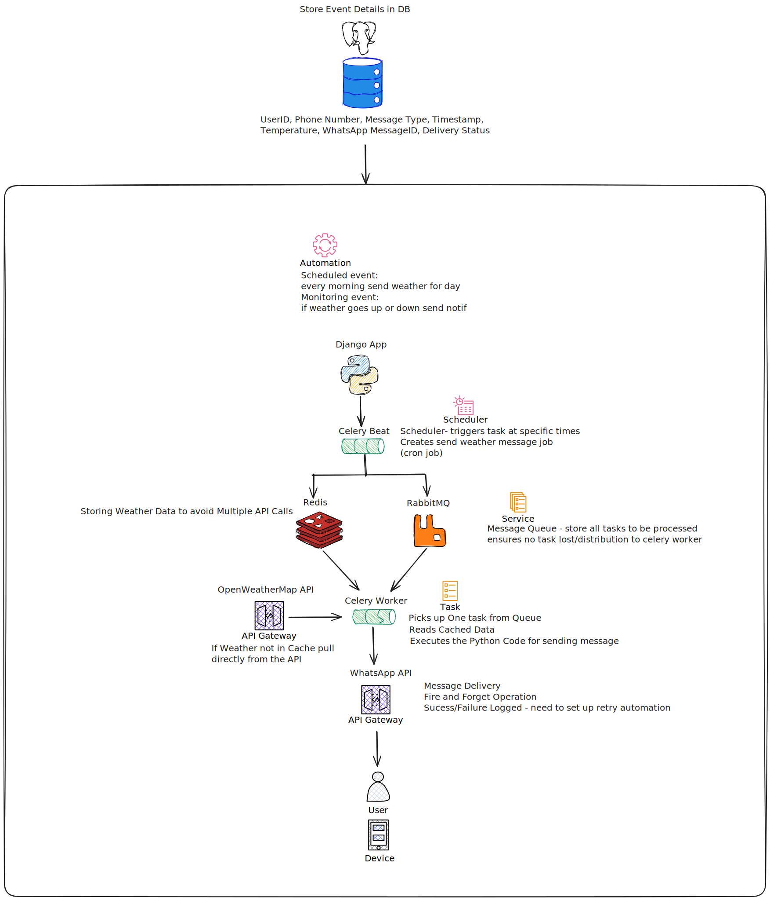
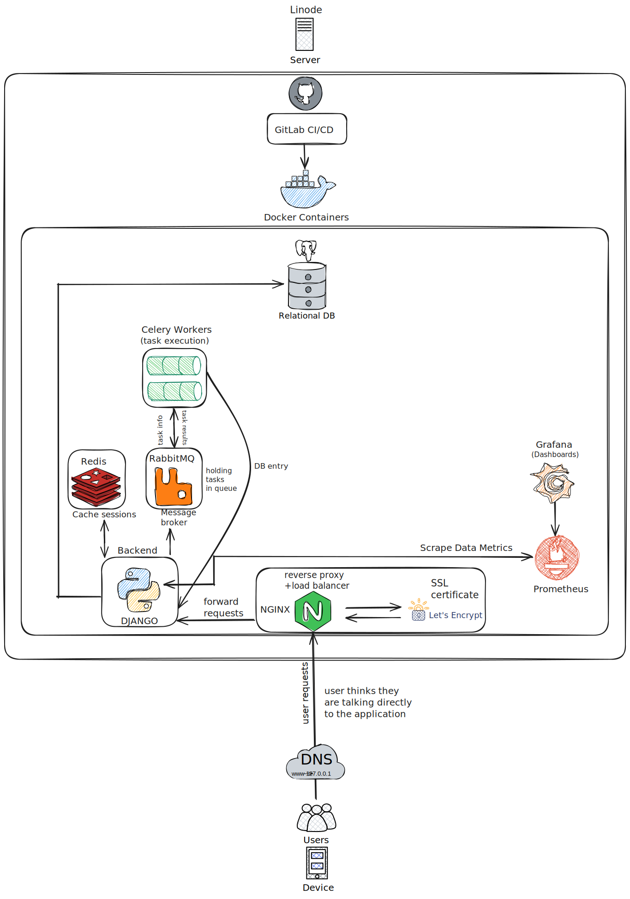
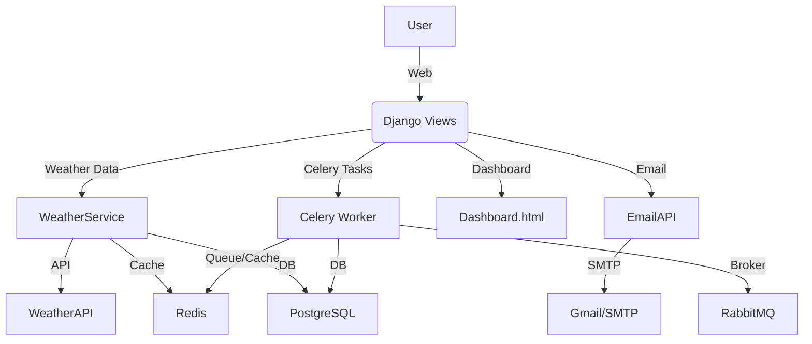

# Weather Project

A robust, production-ready Django web application for real-time weather monitoring, analytics, and alerting. Features include weather data caching, user activity tracking, email notifications, a monitoring dashboard, and background processing with Celery, RabbitMQ, and Redis.

---

## Table of Contents

- [Features](#features)
- [Architecture Overview](#architecture-overview)
- [Tech Stack](#tech-stack)
- [Setup & Installation](#setup--installation)
- [Configuration](#configuration)
- [Usage](#usage)
  - [Web Interface](#web-interface)
  - [Monitoring Dashboard](#monitoring-dashboard)
  - [Management Commands](#management-commands)
- [Celery Tasks & Background Processing](#celery-tasks--background-processing)
- [Testing](#testing)
- [Project Structure](#project-structure)
- [Key Files & Modules](#key-files--modules)
- [API Endpoints](#api-endpoints)

---

## Features

- **Weather Data**: Fetches and caches real-time weather for cities worldwide using WeatherAPI.
- **Caching**: Uses Redis for fast weather data retrieval and rate limiting.
- **Database Models**: Tracks weather requests, user activity, popular cities, email messages, and failed notifications.
- **Email Alerts**: Sends weather updates and temperature alerts via email.
- **Monitoring Dashboard**: Real-time dashboard for system health, queue status, recent activity, and message delivery.
- **Background Processing**: Celery tasks for batching, formatting, and sending notifications.
- **Custom Management Commands**: For cache management, data cleanup, and email testing.
- **Test Coverage**: Unit and integration tests for models, views, email, and Celery tasks.

---

## Architecture Overview

### WhatsApp Message Automation Diagram



### System Design v3 Diagram






---

## Tech Stack

- **Backend**: Django 5.2, Celery 5.3
- **Frontend**: Django Templates (HTML/CSS)
- **Database**: PostgreSQL
- **Cache/Result Backend**: Redis
- **Celery Broker**: RabbitMQ
- **Email**: SMTP (Gmail or custom)
- **Testing**: Django TestCase, unittest.mock

---

## Setup & Installation

1. **Clone the repository**
   ```bash
   git clone <your-repo-url>
   cd weather_project
   ```

2. **Install dependencies**
   ```bash
   pip install -r requirements.txt
   ```

3. **Set up RabbitMQ**
   - Install and start RabbitMQ (see [RabbitMQ installation guide](https://www.rabbitmq.com/download.html))
   - By default, Celery will connect to RabbitMQ at `amqp://localhost`. You can change this with the `CELERY_BROKER_URL` environment variable.
   - Example (default):
     ```env
     CELERY_BROKER_URL=amqp://localhost
     ```

4. **Set up Redis**
   - Install and start Redis (see [Redis installation guide](https://redis.io/download))
   - Used for Django cache, rate limiting, and as the Celery result backend.
   - Example (default):
     ```env
     REDIS_URL=redis://localhost:6379/0
     CELERY_RESULT_BACKEND=redis://localhost:6379
     ```

5. **Configure environment variables**

   Create a `.env` file in the root directory with the following (example):

   ```env
   DJANGO_SECRET_KEY=your-secret-key
   DJANGO_DEBUG=True
   DJANGO_ALLOWED_HOSTS=localhost,127.0.0.1
   DB_NAME=weatherdb
   DB_USER=weatheruser
   DB_PASSWORD=yourpassword
   DB_HOST=localhost
   DB_PORT=5432
   REDIS_URL=redis://localhost:6379/0
   REDIS_HOST=localhost
   REDIS_PORT=6379
   REDIS_DB=0
   WEATHER_API_KEY=your_weatherapi_key
   EMAIL_BACKEND=django.core.mail.backends.smtp.EmailBackend
   EMAIL_HOST=smtp.gmail.com
   EMAIL_PORT=587
   EMAIL_USE_TLS=True
   EMAIL_HOST_USER=your_email@gmail.com
   EMAIL_HOST_PASSWORD=your_email_password
   DEFAULT_FROM_EMAIL=your_email@gmail.com
   CELERY_BROKER_URL=amqp://localhost
   CELERY_RESULT_BACKEND=redis://localhost:6379
   ```

6. **Apply migrations**
   ```bash
   python manage.py migrate
   ```

7. **Run Redis and RabbitMQ**
   - Start Redis server (if not already running)
   - Start RabbitMQ server (if not already running)

8. **Run Celery worker**
   ```bash
   celery -A weather_project worker --loglevel=info
   ```

9. **Run the Django server**
   ```bash
   python manage.py runserver
   ```

---

## Configuration

- **Database**: PostgreSQL (see `weather_project/settings.py`)
- **Cache**: Redis (used for weather data, rate limiting, and Celery result backend)
- **Celery Broker**: RabbitMQ (default, via `amqp://localhost`)
- **Email**: SMTP (configurable via environment variables)
- **Weather API**: Requires a WeatherAPI key

---

## Usage

### Web Interface

- **Landing Page**: `/`  
  Displays Cupertino weather by default, allows fetching random cities' weather, and searching by city.

- **Weather Data**:  
  Weather is cached for 5 minutes per city. Popular cities are tracked and displayed.

### Monitoring Dashboard

- **Dashboard**: `/dashboard/`  
  Real-time stats: messages sent/queued/failed, active workers, users, locations, system health, queue status, recent activity, and failed messages.

### Management Commands

Custom Django management commands (see `weather_app/management/commands/`):

- **Cache Management**:
  ```bash
  python manage.py manage_cache --clear-cache
  python manage.py manage_cache --refresh-cache
  python manage.py manage_cache --sync-db-cache
  python manage.py manage_cache --invalidate-city "London"
  python manage.py manage_cache --show-stats
  python manage.py manage_cache --clear-old-data 30
  python manage.py manage_cache --populate-test-data
  ```

- **Email Testing**:
  ```bash
  python manage.py test_email
  ```

---

## Celery Tasks & Background Processing

- **Weather Batching**: Collects and batches weather requests every 60 seconds.
- **Scheduled Forecasts**: Sends daily morning forecasts to users.
- **Temperature Alerts**: Detects significant temperature changes and sends high-priority alerts.
- **Dead Letter Queue**: Handles permanently failed email messages and retries after review.
- **Admin Alerts**: Notifies admins of system issues or failed messages.

---

## Testing

- **Run all tests**:
  ```bash
  python manage.py test weather_app
  ```

- **Test Coverage**:
  - Views (index, dashboard, API)
  - Models (EmailMessage, CeleryWeatherRequest, etc.)
  - Email sending (mocked)
  - Celery task logic

---

## Project Structure

```
weather_project/
├── manage.py
├── requirements.txt
├── weather_app/
│   ├── admin.py
│   ├── apps.py
│   ├── cache_manager.py
│   ├── email_client.py
│   ├── management/
│   │   └── commands/
│   │       ├── manage_cache.py
│   │       └── test_email.py
│   ├── migrations/
│   ├── models.py
│   ├── tasks.py
│   ├── templates/
│   │   └── weather_app/
│   │       ├── dashboard.html
│   │       └── index.html
│   ├── tests.py
│   ├── urls.py
│   ├── utils.py
│   └── views.py
└── weather_project/
    ├── asgi.py
    ├── celery.py
    ├── settings.py
    ├── settings_ci.py
    ├── urls.py
    └── wsgi.py
```

---

## Key Files & Modules

- **`models.py`**: WeatherRequest, UserActivity, PopularCity, EmailMessage, CeleryWeatherRequest, DeadLetterMessage
- **`views.py`**: Main web views, API endpoints, WeatherService logic
- **`tasks.py`**: Celery tasks for batching, formatting, sending, and error handling
- **`cache_manager.py`**: Cache invalidation and synchronization utilities
- **`email_client.py`**: Email sending abstraction
- **`utils.py`**: Rate limiting utilities (IP and email)
- **`templates/weather_app/`**: Frontend HTML for main page and dashboard
- **`management/commands/`**: Custom Django management commands

---

## API Endpoints

- `/` : Main weather page (GET)
- `/dashboard/` : Monitoring dashboard (GET)
- `/api/dashboard-stats/` : Dashboard stats (GET, JSON)
- `/api/random-weather/` : Get random cities' weather (POST)
- `/api/cache-stats/` : Cache statistics (GET)
- (See `urls.py` and `views.py` for more)

---
